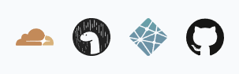

# Markdown is a way to render text

## is an h2

### h3

many flavors of markedonw -> eg. github markedonw

**bold**

_italics_

**_bold / italics_**

create a link: [link to cheatsheet](https://github.com/jamesqquick/markdown-worksheet/blob/master/worksheet.md?plain=1)

<https://github.com/jamesqquick/markdown-worksheet/blob/master/worksheet.md?plain=1d> -makes link also text

photo from your website [is the alt text]

